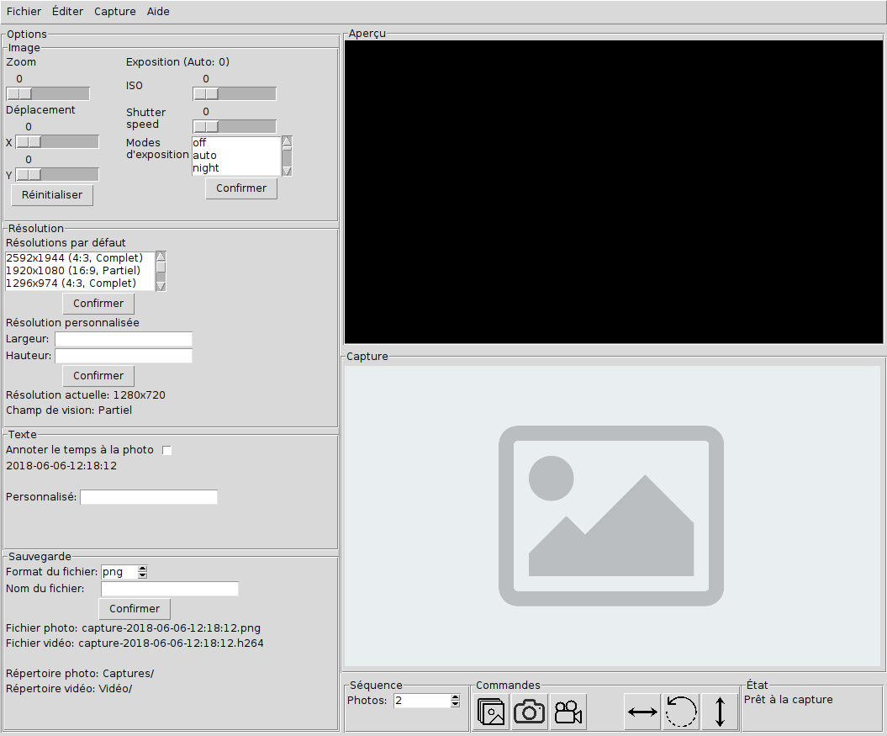

.. PiCamera GUI documentation master file, created by
   sphinx-quickstart on Mon Jun  4 11:52:42 2018.
   You can adapt this file completely to your liking, but it should at least
   contain the root `toctree` directive.

.. _root:

============
PiCamera GUI
============

Ce programme fournit un interface graphique (GUI) pour le `module de caméra`_ de `Raspberry Pi`_.
Ce programme est écrit dans le language de programmation Python à l'aide de la librarie Tkinter.

Fonctionnalités
===============

* Aperçu en temps réel
* Aperçu de la photo prise
* Prise de photo, vidéo et de photos en séquence
* Zoom et déplacement à l'intérieur de l'image en temps réel
* Ajout de texte et du temps présent sur la photo
* Différents formats de photo supportés
* Rotation et revirement horizontal et vertical de l'image

Liens
=====

* Tout le `code source`_ est disponible depuis la plateforme GitHub
* Toute la `documentation`_ est disponible sur ReadTheDocs
* Merci à la documentation complète sur les modules de la `Pi Camera` accesssible sur Read The Docs
* Ce code est licencé sous la `Licence BSD`_

.. _Raspberry Pi: https://www.raspberrypi.org/
.. _module de caméra: https://www.raspberrypi.org/products/camera-module-v2/
.. _Pi Camera: https://picamera.readthedocs.io/
.. _code source: https://github.com/jtpaquet/PiCamera-GUI
.. _documentation: http://picamera-gui.readthedocs.io/en/latest/
.. _Licence BSD: https://opensource.org/licenses/BSD-3-Clause

.. _content:

Bienvenue sur la documentation de PiCamera GUI!
===============================================

Table des matières:

.. toctree::
   :maxdepth: 2
   :numbered:

   install
   userguide
   code
   calltipwindow
   exceptionsmodules
   bibliography
   rights

Interface
=========

Indices and tables
==================

* :ref:`genindex`
* :ref:`modindex`
* :ref:`search`

