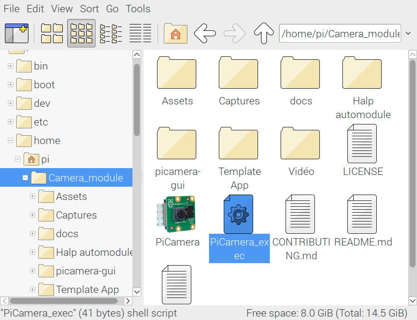
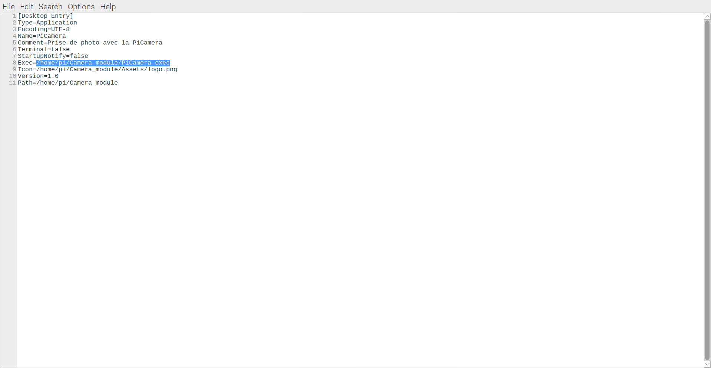

.. _install:

============
Installation
============

Pour accéder au logiciel,

* Installer Python 3. Si votre système Raspberry Pi est à jour, vous pouvez ignorer cette section.
* Télécharger le projet disponible `ici`_
* Déplacer le fichier PiCamera ``[Desktop Entry]`` sur le bureau. Il devrait avoir l'icône du `module PiCamera V2`_
* Modifier le chemin du fichier à exécuter en ouvrant appuyant sur le ``[Desktop Entry]``. Voir :ref:`open`
* Ouvrir le fichier PiCamera

.. _ici: https://github.com/jtpaquet/PiCamera-GUI
.. _module PiCamera V2: https://www.raspberrypi.org/products/camera-module-v2/

.. _python3:

Installation de Python 3
========================

Le plus important est de s'assurer que votre système contient les packages de la picamera. Pour ce faire, entrez la commande suivante dans l'invite de commande de votre Raspberry Pi:

::

	$ sudo apt-get update
	$ sudo apt-get install python3-picamera

Si vous éprouvez des difficultés pour mettre à jour votre Raspberry Pi, consultez cette `page`_ bien détaillée de la documentation du package `Picamera`_.

.. _page: https://picamera.readthedocs.io/en/release-1.10/install3.html
.. _PiCamera: https://picamera.readthedocs.io/en/release-1.10/index.html

.. _download:

Télécharger le projet
=====================

Vous pouvez importer le projet en entrant la commande suivante:

::
	
	$ sudo apt-get install git
	$ git clone https://github.com/jtpaquet/PiCamera-GUI

Sinon, vous pouvez télécharger le projet en tant que fichier compressé .zip et le déplacé dans le répertoire voulu.

.. _open:

Ouvrir l'application
=====================

Déplacer le fichier ayant cette icône sur le bureau.

.. image:: _static/icone.png
    :align: center

Copiez le chemin du fichier (*right click > copy path*) du fichier ``PiCamera_exec`` et coller le chemin dans le fichier avec l'icône déplacé sur le bureau.

Cela modifie le chemin du fichier à exécuter en ouvrant appuyant sur le ``[Desktop Entry]``. Cela exécute un script qui effectue la ligne de commande::

	$ python3 picamera-gui/main.py

En ouvrant ce fichier, l'interface graphique devrait s'ouvrir et vous devriez pouvoir l'utiliser. Assurez vous que la PiCamera soit bien branchée. Si l'erreur persiste, essayez de redémarrer le Rapsberry Pi.

Sinon, vous pouvez ouvrir l'invite de commande (F4) dans le répertoire principal dans lequel se trouve les fichiers et entrer la ligne de commande::

	$ python3 picamera-gui/main.py